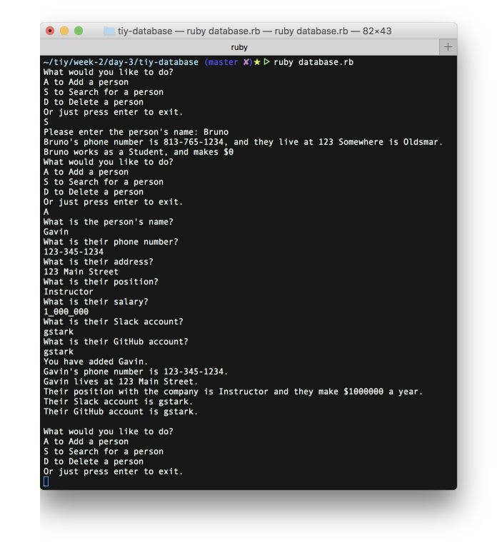

# TIY Database

## The purpose of this program was to build an app that properly looped for each selection the user makes, and for a better understanding of Classes.

### It is a command line program written using Ruby 2.4 and loads from and back to the csv file.

* The main loop of the application shows a menu of options to the user to include: at least:
  * Add a person
  * Search for a person
  * Delete a person
* The app tracks the following information:
  * Name
  * Phone number
  * Address
  * Position (e.g. Instructor, Student, TA, Campus Director)
  * Salary
  * Slack Account
  * Github Account
* When searching for a person, it searches for an exact match
* If the person is found, it shows all their relevant information
* If a person is not found, the app tells the user
* When deleting a person, the app prompts for the name and searches for an exact match.
  * If found, the person is deleted
  * If not found, the user is informed there wasn't a match.
* The system keeps a single array holding all of the people.

* The app saves the array of people to a CSV file when you choose an Exit menu option
* It also loads the array of people from the CSV file when the application is started

